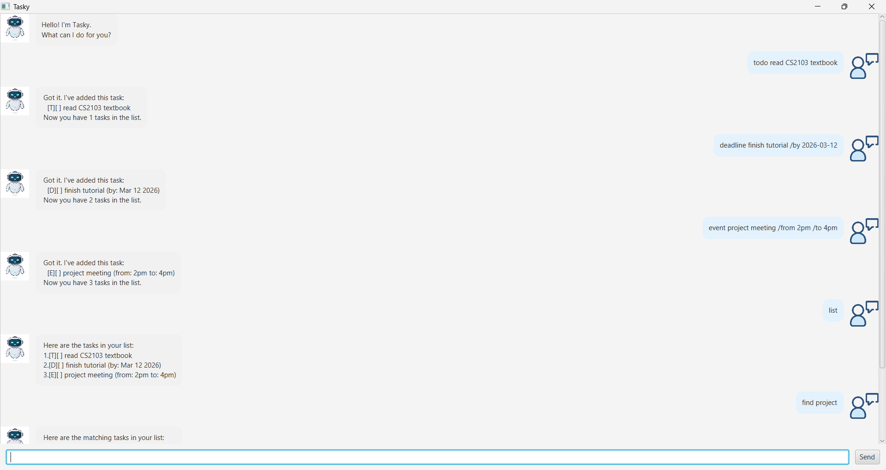

# Tasky User Guide

Tasky is a **command-line task manager chatbot** that helps you
track todos, deadlines, and events efficiently.

Tasky is optimized for users who prefer **typing commands**
instead of clicking buttons.

---

## Screenshot

---

## Features

### 1. Add a Todo

Adds a simple task.

Format:

`todo DESCRIPTION`

Example:

todo read book

Output:

Got it. I've added this task:
[T][ ] read book
Now you have 1 tasks in the list.

---

### 2. Add a Deadline

Adds a task with a due date.

Format:

deadline DESCRIPTION /by YYYY-MM-DD

Example:

deadline submit report /by 2026-04-01

---

### 3. Add an Event

Adds a task with a start and end time.

Format:

event DESCRIPTION /from TIME /to TIME

Example:

event team meeting /from 2pm /to 4pm

---

### 4. List Tasks

Displays all tasks.

list

---

### 5. Mark Task as Done

mark TASK_NUMBER

Example:

mark 1

---

### 6. Unmark Task

unmark TASK_NUMBER

Example:

unmark 1

---

### 7. Delete Task

delete TASK_NUMBER

Example:

delete 2

---

### 8. Find Tasks

Search tasks using a keyword.

find KEYWORD

Example:

find book

---

### 9. Help Command

Shows all available commands.

help

---

### 10. Exit

Exit the application.

bye

---

## Command Summary

| Command | Description |
|-------|-------------|
| todo | add todo task |
| deadline | add deadline |
| event | add event |
| list | show tasks |
| mark | mark task done |
| unmark | mark task not done |
| delete | remove task |
| find | search tasks |
| help | show commands |
| bye | exit program |

---

## Saving Data

All tasks are automatically saved to:

data/tasky.txt

Your tasks will be restored when Tasky starts again.